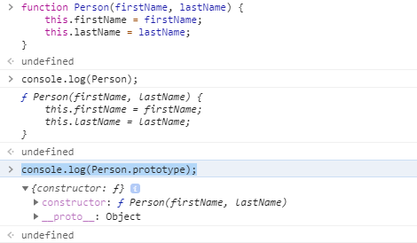

# Khái niệm javascript cơ bản
- Javascript vốn được thiết kế một cách tạm bợ thô sơ, dùng để validate ở client side.
- JavaScript cùng với PHP lại trở thành hai ngôn ngữ được sử dụng để xây dựng nhiều website. Nhưng
  cũng hứng chịu nhiều "gạch đá"

- Javascript tuy xấu xí, nhưng các library/framework của nó lại cực kỳ hay và hữu ích
    + jQuery
    + React, AngularJS, VueJs...

- Nhờ NodeJs mà javascript lấn sân sang mảng back-end

- Nhờ React-Native có thể sử dụng Javascript xây dựng ứng dụng cho mobile
- Tóm lại : Học javascript làm được nhiều mảng khác nhau trong lĩnh vực lập trình.

---
# JavaScript Data Types

- Trong JS có 8 kiểu dữ liệu trong javascript


- Tất cả data types ngoại trừ `Object` gọi là <b>primitive types (kiểu nguyên thủy)</b>
- Kiểu Object là <b>non-primitive</b>
- Lưu ý : <b>Array</b> và <b>Function</b> được coi là subtype của <b>Object</b> (nhóm con), và không được coi như type của JavaScript.

---
## A. undefined, NaN <not a number>, null

### 1. undefined
- <b>undefined</b>: một variable sẽ có giá trị là undefined khi chúng không có giá trị nào hoặc chưa được assign một giá trị nào.
- Ví dụ: undefined.js

```angular2html
let a;
if (a === undefined) {
    console.log('a is undefined. Define it now!'); //a is undefined. Define it now!
}
let obj = { name: 'james', age: 18 };
console.log(obj.sex); // ? Kết quả in ra là gì ?

let arr = [1, 3, 5];
console.log(arr[4]); // ? Kết quả in ra là gì ?

let name = undefined;
console.log(name); // undefined
```

---
- <i>Giải thích:

Chúng ta khai báo một biến var a; chẳng hạn, tại thời điểm này, a sẽ có giá trị là undefined, bởi nó chưa được assign 1 giá trị nào thuộc các variable types kể trên. Hoặc khi truy cập một phần tử không tồn tại trong array, object. Vai trò của undefined ở đây là một cách để kiểm tra xem variable đã có giá trị hay chưa.</i>

- Câu hỏi 1 ?

```angular2html
typeof undefined ----> ? // Kết quả in ra là gì ? // 'undefined'
```

- <b>Kết luận</b> : có 3 trường hợp gây ra undefined
    + Variable chưa được assign
    + Object không tìm thấy key
    + Array không tìm thấy phần tử

---    
### 2. NULL

- Câu hỏi 2 ?

```angular2html
const  whatEver = document.getElementById('what-ever');
console.log(whatEver); // kết quả in ra gì ?

hoặc
const number = null;
```

- <i>Giải thích:
    + Chỉ có 1 trường hợp gây ra null là : Khi ta muốn trả về 1 object nhưng lại không có gì.
    + Ví dụ: Khi tôi muốn get 1 element có id là #what-ever bằng hàm document.getElementById
      tuy nhiên không có 1 element nào như vậy => kết quả trả về NULL </i>
    + null là một giá trị đặc biệt đại diện cho giá trị empty hoặc unknown value.
    + Chú ý: null is not the same as NULL or Null.

---      
- Câu hỏi số 3 ?

```angular2html
console.log(typeof null) // kết quả in ra gì ? // 'object'
```

---

### 3. NaN là Not a Number

- Câu hỏi số 4 ?

```angular2html
const number1 = 3/0;
console.log(number1); // Infinity

const number2 = -3/0;
console.log(number2); // -Infinity

// strings can't be divided by numbers
const number3 = "abc"/3;
console.log(number3);  // NaN

const a = 0/0;
console.log(a); // Kết quả in ra là gì ? // NaN 
console.log(typeof a); // Kết quả in ra là gì ? // number
console.log(a == NaN); // Kết quả in ra là gì ? // false
console.log(isNaN(a)); // Kết quả in ra là gì ? // true
```
- <i>Giải thích : NaN được gán cho những variable là SỐ mà không phải SỐ. Nói cách khác, nó là số, nhưng không phải là số. typeof NaN sẽ trả về number -> nó là số. Nhưng NaN == NaN sẽ trả về false -> nó không phải số, nên không thể có chuyện nó bằng chính nó được.</i>
- Đây là giá trị duy nhất trong lập trình nó không bằng chính nó.

---
## B. Coercion

- Đây là cách thức chuyển đổi type của các giá trị trong javascript, một cách ngầm định
- Nếu chuyển kiểu rõ ràng thì gọi là "type casting"
- Coercion chính là bí ẩn đằng sau những phép so sánh, phép toán không thể dị hơn của javascript.

---
### Case 1: so sánh number và string

```angular2html
console.log(69 == '69'); // Kết quả trả về gì ?
```

- Kết quả TRUE
- Giải thích : string sẽ được convert thành number sau đó so sánh.
- 2 trường hợp xảy ra:
    + string convert được thành number : '10', '12345'...
    + string không convert được thành number : 'abc', 'sfsds123'

- Đối với trường hợp số 2, string sẽ convert thành NaN, và NaN không bằng số nào cả.

---
### Case 2: so sánh boolean với các type values khác

- Sẽ convert boolean value (true => 1, false => 0) thành number, rồi mới so sánh
- Câu hỏi 5 ?

```angular2html
console.log("1" == true) // Kết quả in ra là gì ?
```

- <i>Giải thích:
    + True sẽ được convert thành number 1
    + string sẽ được convert thành 1
    + kết quả 1 == 1 là true</i>

---
### Case 3: so sánh null và undefined

- Câu hỏi 6 ?
```angular2html
console.log(null == undefined) // Kết quả in ra là gì ?
```

- Giải thích :
    + Kết quả in ra là true
    + Tạo sao true ? -> Không giải thích được

---
### Để giải quyết các vấn đề trên

Strict equality operator (===)
Operator này sẽ chỉ compare 2 value, just it, không coercion, không convert type.

---
# Object trong javascript

- Trong lập trình hướng đối tượng có khái niệm Class và Object
- Tuy nhiên trong javascript không có class mà chỉ có object
- Trong các ngôn ngữ OOP như C++, Java, C#, … Có thể tạm hiểu Class chính là cái khung còn Object là vật thể tạo ra dựa vào cái khung đó
- Chúng ta có thể khởi tạo 1 object mà không cần xác định class của nó
- Có thể hiểu toàn bộ object đều có <b>class chung là Object</b>.
- Có thể hiểu một object là một tập hợp các trường dữ liệu (property) và các hàm (method)

```angular2html
const person = {
    firstName: 'Linh',
    lastName: 'Hoang Thuy',
    showName: function() {
        console.log(this.firstName + ' ' + this.lastName);
    }
};
```

---
## Cách khởi tạo object

- Có 2 cách khởi tạo object trong JS

```angular2html
// Cách 1 : Object literal
var person = {
    firstName: 'Linh',
    lastName: 'Hoang Thuy',
    showName: function() {
        console.log(this.firstName + ' ' + this.lastName);
    }
}

// Cách 2 : Object constructor
var psn = new Object();
psn.firstName = 'Linh';
psn.lastName = 'Hoang Thuy';
psn.showName = function() {
    console.log(this.firstName + ' ' + this.lastName);
};
```

---
### Các Tip với object
#### a. Truy xuất field/function của object

```angular2html
var person = {
    firstName: 'Linh',
    lastName: 'Hoang Thuy',
    18: 'Age', // Property có tên là số, không dùng dotNotation được
    showName: function() {
        console.log(this.firstName + ' ' + this.lastName);
    }
};

console.log(person.firstName); // Linh
console.log(person['firstName']); // Linh

console.log(person.18); // Bị lỗi
console.log(person['18']); // Age

console.log(person.showName()); // Hoang Thuy Linh
console.log(person['showName']()); // Hoang Thuy Linh
```

- Để duyệt qua toàn bộ các trường của một object, ta chỉ cần dùng hàm for đơn giản

```angular2html
var person = {
    firstName: 'Linh',
    lastName: 'Hoang Thuy',
    showName: function() {
        console.log(this.firstName + ' ' + this.lastName);
    }
};

for(var prop in person) {
    console.log(prop); // firstName, lastName, showName
}
```

---
#### b. Thêm/xóa field/function của object

```angular2html
var person = {
    firstName: 'Linh',
    lastName: 'Hoang Thuy',
    showName: function() {
        console.log(this.firstName + ' ' + this.lastName);
    }
};

delete person.lastName; // Xóa trường lastName
person.lName = 'Just adding'; // Thêm trường lName

console.log(person.lastName); // undefined
console.log(person.lName); // Just adding
```

---
#### c. Serialize và deserialize

- Javascript hỗ trợ sẵn việc chuyển object sang chuỗi JSON và ngược lại

```angular2html
var person = {
    firstName: 'Linh',
    lastName: 'Hoang Thuy',
    showName: function() {
        console.log(this.firstName + ' ' + this.lastName);
    }
};

// Serialize sẽ làm mất method, chỉ giữ các property
JSON.stringify(person); // '{"firstName":"Hoang","lastName":"Pham"}'

var jsonString = '{"firstName":"Hoang","lastName":"Pham"}';
var psn = JSON.parse(jsonString); // Chuyển string thành object
console.log(psn.firstName); // Linh
console.log(psn.lastName); // Hoang Thuy
```

---
# Prototype

- Prototype là phương pháp để thực hiện tính kế thừa trong JS
- Trong JS, ngoại trừ <i>undefined</i>, tất cả các kiểu còn lại đều là object
    + Kiểu Mảng là object dạng Array
    + Kiểu Hàm là object dạng Function
    + Kiểu String là object dạng String

- Prototype object

```angular2html
function Person(firstName, lastName) {
    this.firstName = firstName;
    this.lastName = lastName;
}

Person.prototype.showFullName = function() {
    console.log(this.firstName + ' ' + this.lastName);
}

var singer = new Person('Linh', 'Hoang Thuy');
console.log(singer); // Person { firstName: "Linh", lastName: "Hoang Thuy" }
justin.showFullName(); // Linh Hoang Thuy
```

---
- Giải thích:
    + Khởi tạo function Person (Object constructor)
    + Khi function Person được tạo, mặc định nó sẽ có một thuộc tính có tên là prototype (lưu ý là function trong JavaScript cũng là một object).
      ```
          // Kiểm tra sự tồn tại của thuộc tính prototype bằng cách
          console.log(Person.prototype)
      ```
    + Thuộc tính prototype này là một object mà ban đầu chỉ có chứa một property là constructor trỏ ngược lại function Person.

      

    + hi function Person này được gọi với từ khóa new, <b>object mới</b> được tạo sẽ kế thừa tất cả các property từ Person.prototype
    + Ví dụ trên Person.prototype được thêm hàm showFullName và object mới singer được kế thừa từ Person

- Tóm tắt các bước để thực hiện kế thừa trong javascript
    + Bước 1 : Tạo 1 hàm khởi tạo
    + Bước 2 : Thêm các thuộc tính và phương thức vào `thuộc tính prototype mặc định của hàm khởi tạo`
    + Bước 3 : Tạo ra 1 instance mới bằng từ khoá new, instance sẽ chứa đầy đủ thuộc tính và phương thức của hàm khởi tạo
      ngoài ra, còn chứa thêm các thuộc tính và phương thức đã thêm ở bước 2

 --- 
- Thêm 1 ví dụ về Prototype

```
// Bước 1. Tạo ra 1 hàm constructor <Hàm constructor về động vật>
function Animal(_age){
   this.age = _age;
}
 
// Bước 2. Thêm thuộc tính hoặc 1 hàm vào thuộc tính prototype của hàm khởi tạo
Animal.prototype.showAge = function(){
   console.log(this.age);
};

// Bước 3. Tạo ra 1 hàm constructor (sẽ dùng để kế thừa từ động vật)
function Dog(_color){
   this.color = _color;
}

// Bước 4. Thực hiện kế thừa bằng cách gán cho thuộc tính prototype của Dog với hàm constructor của Animal
// Ngoài ra, mở rộng thêm 1 phương thức khác nữa vào prototype là showColor
Dog.prototype = new Animal();
Dog.prototype.showColor = function(){
   console.log( this.color );
};

// Bước 5. Kiểm tra sự kế thừa
// - Khởi tạo 1 instance mới
// - Instance này có thể sử dụng thuộc tính age và function showAge của Animal
// - Instance này có thể sử dụng được thuộc tính color và hàm showColor của Dog

var chophuquoc = new Dog('yellow');
chophuquoc.age = 3;
chophuquoc.showAge();       //3
chophuquoc.showColor();     //yellow
```  

- Prototype chain

Prototype rất quan trọng trong việc giúp ta truy cập tới các thuộc tính và phương thức của đối tượng. Khi chúng ta truy cập vào một Property của một Object, JavaScript sẽ tìm Property đó bên trong chính Object. Nếu không có nó sẽ tiếp tục tìm lên trên Prototype của Object và cứ tiếp tục như thế cho đến khi gặp Object.prototype thì dừng và cho ra kết quả (undefined nếu không tìm thấy).
Quá trình lặp lại này được gọi là chuỗi prototype (prototype chain) trong Javascript.

---