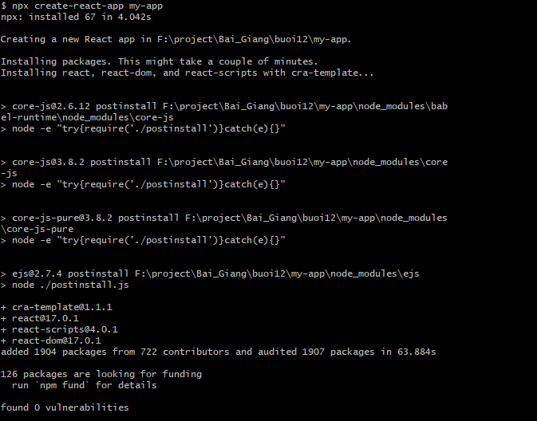
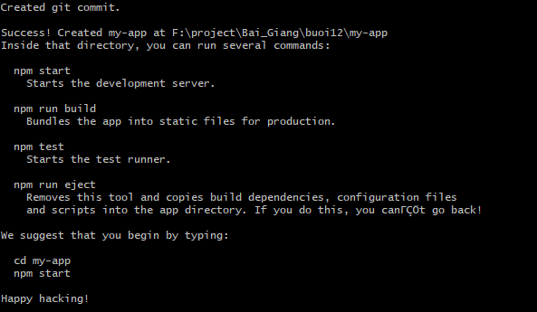

### 1. Cài đặt NodeJS và NPM

- Check cài đặt node và npm

```angular2svg
node -v
npm -v
```

2. Khởi tạo ReactJS App

```angular2svg
npx create-react-app my-app
```




```angular2svg
npm start
```