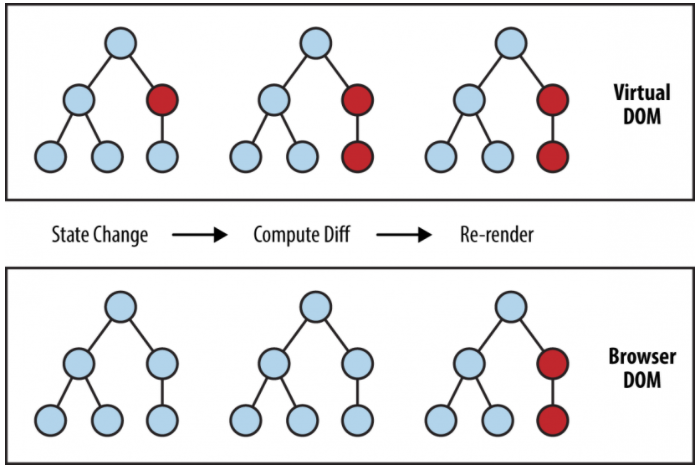
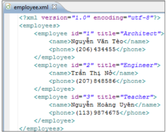
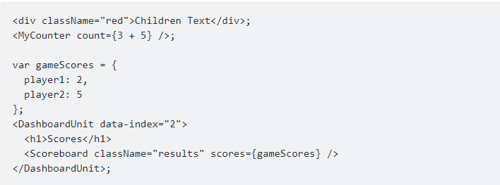
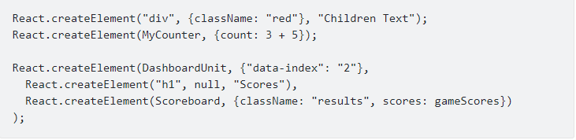

### 1. React là gì ?

- ReactJS là một thư viện JavaScript có tính hiệu quả và linh hoạt để xây dựng các thành phần giao diện người dùng (UI) có thể sử dụng lại.

- ReactJS giúp phân chia các UI phức tạp thành các thành phần nhỏ (component).

- ReactJS được dùng để xây dựng các ứng dụng [single page application] (SPA)

### 2. Tổng quan các kiến thức cơ bản

#### a. Virtual DOM

- Nhắc lại kiến thức về DOM
    + DOM là một Document Object Model và là một cấu trúc trừu tượng của text.
    + DOM sử dụng để truy xuất và thao tác trên code HTML và XML bằng các ngôn ngữ lập trình như Javascript.  
    + Các đoạn code HTML được gọi là HTML DOM.
    + Mỗi elements trong HTML là các nodes của DOM.
    
```angular2html
<html>                                                   -> document node
<head>                                                   -> element node - head
    <title>
        HTML DOM                                         -> text node
    </title>                                             -> element node - title
</head>                                                  
<body>                                                   -> element node - body
</body>                                                   
</html>
```
    + HTML DOM cung cấp API để duyệt và chỉnh sửa các node.
    + Một vài API function quen thuộc như : getElementById, removeChild...
    + Việc thao tác đọc ghi các node với DOM thì nhanh
    + Tuy nhiên việc gây chậm ở đây : các công việc mà browser phải làm mỗi khi DOM thay đổi
        -> Công việc 1 : Tính toán lại CSS
        -> Công việc 2 : Thực hiện dựng lại trang web
    + Trên đây là 2 công việc tốn thời gian và gây chậm, cây DOM càng lớn, tốc độ càng chậm

- Virtual DOM
    + ở DOM có thẻ `div` và các thẻ `p`
    + ReactJs sử dụng Virtual DOM bằng cách tạo ra các object `React.div` và `React.p` <dựa trên DOM thật để tạo ra>
    + Cách hoạt động:
        + React lấy một snapshot của Virtual DOM (snapshot là 1 trạng thái tại 1 thời điểm của DOM ảo)
        + React sử dụng snapshot này để so sánh với một Virtual DOM được cập nhật trước khi thực hiện các thay đổi.
        + Khi cập nhật được cấp cho Virtual DOM, React sử dụng thuật toán `Diffing` để so sánh và đối chiếu để biết được sự cập nhật được diễn ra ở đâu sau đó cập nhật lên DOM thật mà bỏ qua những elements không liên quan.
        + Lợi ích của Virtual DOM : -> Giúp phát hiện sự thay đổi trên DOM thật, và cập nhật 1 phần, giúp tăng performance
    
    

#### b. JSX

- Nhắc lại về cú pháp của XML
    + XML là viết tắt của từ eXtensible Markup Language
    + Cú pháp của tài liệu XML được xây dựng dựa vào cấu trúc NODE lồng nhau
    + Mỗi node sẽ có một thẻ mở và một thẻ đóng như sau
    ```angular2html
        <nodename>nội dung</nodename>
    ```
  Trong đó:
    ```angular2html
        - <nodename> là thẻ mở, tên của thẻ tự định nghĩa
        - </nodename> là thẻ đóng
        - content là nội dung của thẻ này
    ```  
    
   


- Vậy JSX = Javascript + XML.
- Giúp người lập trình có thể code ReactJS bằng cú pháp của XML thay vì sử dụng Javascript.
- Cú pháp của JSX
    + Thẻ mở tag: 
    ```angular2html
        <JSXElementName JSXAttributesopt>
    ```
    + Thẻ đóng tag:
    ```angular2html
        </JSXElementName>
    ```
    + Ví dụ:
    ```angular2html
        <MyButton color="blue" shadowSize={2}>
            Click Me
        </MyButton>
    ```
- JSX hỗ trợ SelfClosingElement
    ```angular2html
        <JSXElementName JSXAttributes />
    ```
    
    ```angular2html
        <div className="sidebar" />
    ```
    Chú ý : đây là cú pháp của JSX - rất giống với HTML, không đc nhầm lẫn.

    ```angular2html
        HTML tag không cần đóng cũng được nhưng JSX cần thiết phải đóng tag.
    ```
  
- Tại sao phải sử dụng JSX
    + Việc sử dụng JSX trong ReactJS là không bắt buộc.
    + Có thể sử dụng chỉ JS thuần.
    + So sánh code JSX và JS thuần
    
    

    

- Gán một biểu thức trong JSX
    + Gán biến `name` vào trong JSX bằng cách bọc nó trong dấu {}   
    ``` 
        const name = 'Nguyen Tuan Anh';
        const element = <h1>Hello {name}</h1>;

        ReactDOM.render(
            element,
            document.getElementById('root')
        );
    ```
    + Trong dấu đóng mở ngoặc nhọn ngoài biến, có thể để hàm, biểu thức tính toán...như js thuần
    
    ```angular2svg
        function formatName(user) {
            return user.firstName + ' ' + user.lastName;
        }

        const user = {
            firstName: 'Nguyễn',
            lastName: 'Tuấn Anh'
        };

        const element = (
            <h1>
                Xin chào, {formatName(user)}!
            </h1>
        );

        ReactDOM.render(
            element,
            document.getElementById('root')
        );
    ```
  
- JSX là một biểu thức
    + JSX như các object Javasript thông thường.
    + Có thể sử dụng JSX bên trong if, for, function,...
    + Ví dụ viết 1 hàm trả về JSX
    ```angular2svg
        function sayHi(name) {
            if (name) {
                return <p>Xin chào, {name} !</p>
            } else {
                return <p>Xin chào bạn !</p>
            }
        }
    ```
  
- Chỉ định attributes với JSX
    + Có thể chỉ định một attribute trong JSX, cú pháp giống như HTML thông thường
    ```angular2svg
        const element = <div tabIndex="0"></div>;
    ```
    + Hay chỉ định attributes với JSX bằng biểu thức javascript như này
    ```angular2svg
        const element = </img>;
    ```
  
- Phần tử con trong JSX
    + Nếu chỉ có một tag chỉ cần đóng nó bằng dấu />
    ```angular2svg
        const element = ;
    ```
    + Trường hợp trong tag có nhiều phần tử con, cần phải bọc ngoài nó bằng một JSX tags
    ```angular2svg
        //Đúng cú pháp
        //Phải bọc nó bằng một tags
        const element = (
          <div>
            <h1>Hello</h1>
            <p>Welcome to Freetuts</p>
          </div>
        );

        //Viết sai
        //Các phần từ không được bọc
        const element = (
            <h1>Hello</h1>
            <p>Welcome to Freetuts</p>
        );
    ```
  
- JSX Object
    + Để complide một JSX object thành JSX thông thường chúng ta sử dụng React.createElement()
    ```angular2svg
        const element = React.createElement(
          "p",
          { className: "welcome" },
          "Welcome to Freetuts.net!"
        );

        const element = <p className="welcome">Welcome to Freetuts.net!</p>
    ```
#### c. Components

- Components giúp phân chia các UI (giao diện người dùng) thành các phân nhỏ để dễ dàng quản lý và tái sử dụng.
- Dựa vào props mà component sẽ có những hiển thị khác nhau và có thể tái sử dụng
- Khởi tạo component
  + Trong thư mục gốc của dự án tạo folder components
    ```angular2svg
      public/
      node_modules/
      src/
      -----components/
      ---------------Components sẽ viết ở trong thư mục này
      -----App.js
      -----index.js
      ---- vv....
      packages.json
      packages-lock.json
    ```
    
- Functional Component
  + Định nghĩa component kiểu function
  ```angular2svg
    //Import react vào trong dự án
    import React from "react";

    const Welcome = function(props) {
      return (
        <div>
          <h1>Welcome ! I am a functional component </h1>
        </div>
      )
    }
    export default Welcome;
  ```
  
  + Function component thì sẽ không có các khái niệm như state, life cycles, events,...
  + Trong phiên bản gần đây thì React cũng đã hỗ trợ thêm React Hooks cho phép bạn làm việc với state, lifecycles dễ dàng hơn trong funcitonal components.
  
  
- Class component
  + khi viết một class component bạn sẽ sử dụng được hầu hết các chức năng của component như state, props, lifecycle,..
  + Ví dụ
  ```angular2svg
    import React, { Component } from "react";
    class Welcome extends Component {
        render() {
          return (
            <div>
              <h1>Welcome ! I am a class component </h1>
            </div>
          );
        }
    }
export default Welcome;
  ```
#### d. Props và state

#### e. React lifecycle