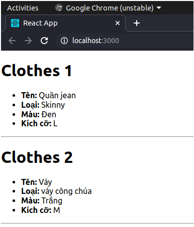
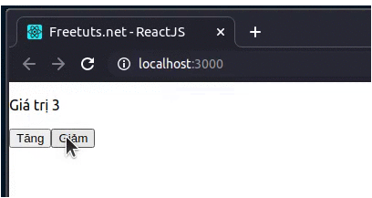
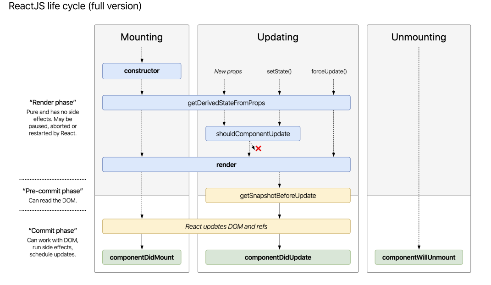
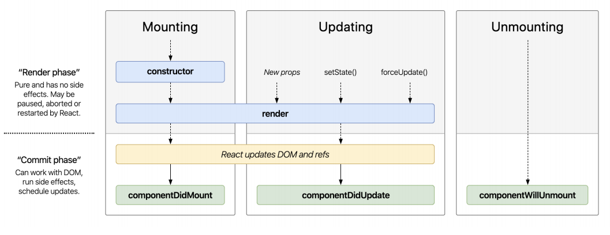

### 1. Props trong react

- Props là một object được truyền vào trong một components, mỗi components sẽ nhận vào props và trả về react element.
- Props cho phép chúng ta giao tiếp giữa các components với nhau bằng cách truyền tham số qua lại giữa các components.
- Khi một components cha truyền cho component con một props thì components con chỉ có thể đọc và không có quyền chỉnh sửa nó.
- Cách truyền một props cũng giống như cách thêm một attributes cho một element HTML.

```angular2svg
const App = () => <Welcome name="Nguyen Tuan Anh"></Welcome>
```

- Ví dụ 1: Xây dựng ứng dụng hiển thị danh sách quần áo



### 2. State trong react

- State là một object có thể được sử dụng để chứa dữ liệu hoặc thông tin về components
- State có thể được thay đổi bất cứ khi nào mong muốn
- Khác với props có thể truyền props sang các components khác nhau thì state chỉ tồn tại trong phạm vi của components chứa nó
- Mỗi khi state thay đổi thì components đó sẽ được render lại.
- Trong react : state được dùng để phản hồi các yêu cầu từ người dùng, hay lưu trữ một dữ liệu nào đó trong components.

#### Thao tác với state trong ReactJS

##### a. Khởi tạo state
- Sử dụng state trong class component, không sử dụng đc trong functional component
- Cú pháp:
    ```angular2svg
        this.state = { name : 'Hoang Thuy Linh' }
    ```
  
- Lấy giá trị của state:
    ```angular2svg
        console.log(this.state.name) //Hoang Thuy Linh
    ```
  
- Constructor là hàm khởi chạy đầu tiên khi một components được gọi.
- Vì thế trong hầu hết trường hợp nên khởi tạo state bên trong hàm constructor() để tránh gặp các lỗ không mong muốn.
  
- Ví dụ về state:
    ```angular2svg
        import React from "react";

        class App extends React.Component {
            constructor(props) {
                super(props);
                // Chỉ định một state
                this.state = { name: "Nguyen Tuan Anh" };
            }
            render() {
                return (
                    <div>
                    <h1>Học ReactJS căn bản tại {this.state.website} </h1>
                    </div>
                );
            }
        }
  
        export default App;
    ```

##### b. Cập nhật state

- Cú pháp:

```angular2svg
this.setState({
     name : 'newValue'
})
```

- Lấy giá trị của state trước khi cập nhật

```angular2svg
this.setState((state) => {
      return newValue;
});
```

- Ví dụ : Tăng giảm giá trị



```angular2svg
import React from "react";
 
class App extends React.Component {
  constructor(props) {
    super(props);
    //Chỉ định một state
    this.state = { index: 1 };
  }
  render() {
    return (
      <div>
        <p>Giá trị {this.state.index}</p>
        <button
          onClick={() => {
            this.setState({
              index: this.state.index + 1
            })
          }}
        >
          Tăng
        </button>
        <button
          onClick={() => {
            this.setState({
              index: this.state.index -1
            })
          }}
        >
          Giảm
        </button>
      </div>
    );
  }
}
export default App;
```

### So sánh props và state

- <b>State</b> - Dữ liệu chỉ nằm trong phạm vi của một component. Nó được sở hữu bởi một components cụ thể mà chỉ là của component đó thôi. Ví dụ, như người yêu bạn chỉ là của bạn vậy =))). Và mỗi khi state thay đổi thì component cũng phải thay đổi theo.
- <b>Props</b> - Dữ liệu đường truyền từ component cha cho componet con, components con khi nhận được sẽ chỉ được đọc mà không thể thay đổi dữ liệu đó.

Sự khác nhau chính của 2 khái niệm này là component sở hữu dữ liệu. State là chỉ riêng nó có thể sử dụng. Props là dữ liệu mà component con được nhận về từ một component cha.
Vì phạm vi của state chỉ nằm trong components nên việc truyền dữ liệu từ các components với nhau người ta thường dùng props. Nhưng vấn đề ở đây là props chỉ có thể truyền cho componet con của nó và khi truyền cho các componet cháu, chắt khá rắc rối. Bởi vậy chúng ta có thêm khái niệm về <b>Redux</b>

### 3. Component life cycle trong react

`Life cycle = vòng đời`

- Giống như vòng đời của con người : Sinh ra, lớn lên và mất đi
- Với component trong react cũng có 3 giai đoạn tương tự
  + Được tạo ra <b><Mouting></b> : được add vào trong dom (UI)
  + Qua nhiều thay đổi <b><Updating></b> : 
  + Qua nhiều thay đổi <b><Unmouting></b> : remove ra khỏi dom (UI)
  
- Mỗi 1 giai đoạn sẽ trải qua lần lượt các hàm như bên dưới
- Tham khảo:
  
  
- <b>Mounting</b> : Chỉ diễn ra đúng 1 lần (Sinh ra 1 lần)
  + constructor
  + getDerivedStateFromProps
  + render -> Render lần đầu tiên
  + Update DOM
  + ComponentDidMount

- <b>Updating</b> : Thực thi được nhiều lần (Lớn lên 1 lần)
  + getDerivedStateFromProps
  + shouldComponentUpdate
  + render
  + getSnapshotBeforeUpdate
  + Update DOM
  + ComponentDidUpdate

- <b>Unmounting</b> : Chỉ diễn ra đúng 1 lần (Chết đi 1 lần)
  + ComponentWillUnmount

- Nhiều hàm quá, không nhớ nổi => Tham khảo bản rút gọn
  
  
  + ComponentDidMount : Được gọi 1 lần
  + Hàm ComponentDidUpdate -> Được gọi khi Props hoặc State thay đổi (nhiều lần) : Hàm này hạn chế sử dụng vì dễ gây ra vòng lặp vô tận
  + ComponentWillUnmount: Được gọi 1 lần
  
- Những life cycle của version cũ không dùng nữa
  + componentWillMount()
  + componentWillReceiveProps()
  
- So sánh Component và PureComponent
  + Component : hàm shouldComponentUpdate luôn luôn return true
  + PureComponent : trong shouldComponentUpdate thực hiện so sánh props, state trước và sau
    + Nếu trước = sau -> Không render
    + Nếu trước != sau -> render
  + Khuyến khích : sử dụng PureComponent để nâng cap performance
  
- Tác dụng của một vài life cycle
  + Contructor
    + Sử dụng super(props)
    + Khai báo state.
    + Định nghĩa properties của component
    ```
      class App() extends PureComponent {
          constructor(props) {
            super(props);
            this.DEFAULT_MAX_LENGTH = 10;
            this.state = {
              productList: [],
            };
          }
      }
    ```
  + componentDidMount()
    + Khởi tạo dữ liệu cho component : call API, biến đổi dữ liệu, cập nhật state
    ```angular2svg
       class HomePage extends PureComponent {
          constructor(props) {
              super(props);
              this.state = {
                loading: true,
                productList: [],
              };
          }
    
          async componentDidMount() {
            try {
              // Call API
              analytics.page('Home page');
              const productList = await productApi.getAll();
              this.setState({
                productList,
                loading: false,
              });
            } catch (error) {
              console.log('Failed to fetch product list: ', error);
              this.setState({ loading: false });
            }
          }
    
          render() {
            const { loading, productList } = this.state;
            if (loading) return <Loader />;
            return <ProductList productList={productList}>
          }
       }
    ```
    
  + componentWillUnmount()
    + Cleartimeout hoặc interval nếu có dùng
    + Reset dữ liệu trên redux nếu cần thiết.
    ```angular2svg
      class Countdown extends PureComponent {
        constructor(props) {
          super(props);
          this.state = {
            currentSecond: 0,
          };
        }
    
        componentDidMount() {
          this.timer = setInterval(() => {
            this.setState(prevState => ({
              currentSecond: prevState.currentSecond - 1,
            }));
          }, 1000);
        }
    
        componentWillUnmount() {
          if (this.timer) {
            clearInterval(this.timer);
          }
        }
    
        render() {
          const { currentSecond } = this.state;
          return <p>{currentSecond}</p>;
        }
      }
    ```
  + getderivedstatefromprops : Tham khảo
  https://thaunguyen.com/blog/javascript/reactjs-getderivedstatefromprops-la-gi
  https://topdev.vn/blog/react-component-lifecycle/  