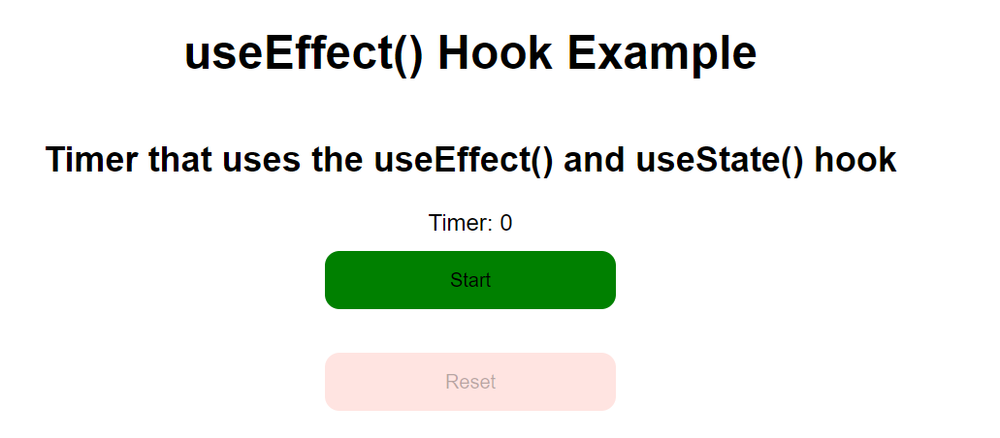

### Bài 1.

- Sử dụng useEffect(giống hàm componentWillUnMount) và useState làm ví dụ giống như ảnh dưới.


### Bài 2.

- Thực hiện thêm chức năng sorting theo name và filter theo gender trong ví dụ
- Cột Gender: Filter theo `female` và `male`
- Cột name: Sorting theo alphabet

```integrationperformancetest
demo-use-effect-antd
```