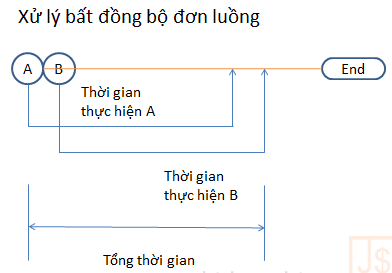

### 1. This và bind this

- [Ví dụ](https://freetuts.net/hieu-hon-ve-ham-bind-trong-javascript-785.html)
- [Hàm closure](https://freetuts.net/closure-trong-javascript-758.html)
### 2. Lập trình đồng bộ (synchronous) và IO blocking

#### a. Lập trình đồng bộ

- Là cách lập trình mà câu lệnh chạy tuần tự nhau, lệnh trước chạy xong thì lệnh sau mới có thể chạy
- Thứ tự thực hiện


```angular2html
TaskA -> TaskB
TaskD -> Task E so slowwwwwwww -> Task F
```

- Kết luận : Khi phải xử lý các tác vụ IO như
    + Đọc file
    + Query dữ liệu từ database
    + Gửi request lên server và nhận về dữ liệu

đây gọi chung là các công việc tốn nhiều thời gian và không biết bao giờ kết thúc.
Nếu xử lý lập trình đồng bộ => Dẫn đến hiện tượng IO blocking

#### b. IO blocking

- Là hiện tượng xảy ra với code đồng bộ khi ta thực hiện 1 task vụ quá lâu
- Các task sau phải đợi và browser không phản ứng lại các sự kiện trên UI
- Dẫn đến lỗi "Not responding" (con trỏ chuột xoay tròn) -> Trên Windows
- Đối với browser dẫn trên treo trình duyệt

### 2. Lập trình bất đồng bộ (asynchronous)

- Để khắc phục tình trạng blocking như trên có 2 cách :
    + xử lý đa luồng <multiple thread>
    + xử lý bất bất đồng bộ  <synchronous>
- Xử lý đa luồng
    + Mỗi công việc tốn thời gian sẽ được xử lý trên 1 thread riêng biệt và không đc can thiệp vào main thread
    + Vẫn có thể thực hiện các công việc tốn thời gian mà vẫn có thể bắt các sự kiện ở thread chính.

  

    + Tuy nhiên, javascript hoạt động theo cơ chế single thread <đơn luồng>

- Xử lý bất đồng bộ

  
    + Khi task A bắt đầu thực hiện, chương trình tiếp tục thực hiện task B mà không đợi A kết thúc
    + Bài toán đặt ra : Phải có 1 cơ chế nào đó biết được khi nào A kết thúc
    + Giải đáp : Cơ chế này trong javascript là <b>Callback, Promise hoặc Async/await</b>

### 3. Callback

- Callback là kỹ thuật truyền 1 function vào 1 function khác làm tham số
- Thứ tự thực hiện là : `hàm chính bắt đầu -> hàm chính kết thúc -> hàm callback sẽ được gọi`
- [Ví dụ](https://www.w3schools.com/js/js_callback.asp)

Ví dụ 1 : Thực hiện đoạn code và trả lời kết quả
```angular2svg
function first() {
    console.log("Một");
}

function second() {
    console.log("Hai");
}

// execute function
first();
second();
```

- Output

```angular2svg
// Một
// Hai
```

Ví dụ 2 : Thực hiện đoạn code và trả lời kết quả

```angular2svg
function first(){
    // Mô phỏng delay code
    setTimeout( function(){
        console.log("Một");
    }, 5000);
}
function second(){
    console.log("Hai");
}

first();
second();
```

- Ví dụ thực tế: Xem file Callback2.js

- Callback hell
    + Khi thực hiện nhiều công việc bất đồng bộ liên tiếp nhau
    + Những callback lồng vào nhau quá nhiều nên sẽ làm code khó đọc, khó hiểu, khó debug
    + Ví dụ : xem file callback_hell.js

### 4. Promise

- Để tránh callback_hell ta sử dụng promise
- Cú pháp

```angular2svg
let promise = new Promise(function(resolve, reject) {
  // Code here
});
```

Trong đó:
+ Hàm được truyền vào `new Promise` gọi là <b>executor</b>.
+ Ban đầu, Promise có state là `pending` và kết quả `value` là `undefined`
+ Khi executor kết thúc công việc, nó sẽ gọi đến 1 trong 2 hàm được truyền vào
    + <b>resolve(value)</b>: để xác định rằng công việc đã thực hiện thành công
        + state chuyển thành <b>fulfilled</b>
        + kết quả là <b>value</b>
    + <b>reject(error)</b>: để xác định rằng đã có lỗi xảy ra
        + state chuyển thành <b>rejected</b>
        + kết quả là error

- Vậy Promise có 3 trạng thái
    + Pending: promise đang thực hiện chưa xong
    + Full filled: trạng thái đã thực hiện xong, kết quả thành công
    + Rejected: trạng thái đã thực hiện xong, kết quả thất bại

- Ví dụ : Xem ví dụ promise.js

- Các method của Promise
    + then() :
        + Được gọi khi promise thành công
        + Nhận parameter là 1 callback function, trả về dữ liệu của resolve
    + catch() :
        + Được gọi khi promise thất bại
        + Nhận parameter là 1 callback function, trả về dữ liệu của reject
    + finally() :
        + Được gọi khi cả thành công và thất bại -> Promise state : settled
        + Promise state : settled

- Ví dụ trong thực tế khi sử dụng Promise trong bất đồng bộ call API
  Xem file promise2.js

- Promise all
    + Gộp nhiều API vào chạy cùng 1 lúc
    + Sử dụng trong việc call các API lấy về dữ liệu tổng hợp
    + Sử dụng trong việc gửi email hàng loạt...
    + Ví dụ : Xem file promise2.js

### 4. Async/await

- Async/await được bổ sung vào ECMAScript 2017 để hỗ trợ sử dụng promise
- Async/await là một cú pháp đặc biệt giúp làm việc với Promise dễ dàng hơn.
- Cấu trúc chương trình xử lý bất đồng bộ sẽ giống với chương trình xử lý đồng bộ hơn.
- Ví dụ : Xem file async_await.js

### Bài tập về nhà
+ Bài 1
- Nhập vào tên user từ input
- Hiển thị thông tin của user từ github dựa vào API của github
- Các thông tin cần lấy ra : Tên, avatar, email, tên công ty, số lượng người flow
- Gợi ý :
    + Thiết kế giao diện form sử dụng HTML/CSS bao gồm input và 1 button + list danh sách <Tên, avatar, email, tên công ty, số lượng người flow>
    + Khi user nhập tên và click button, sẽ lấy tên và call API github
    + API : https://api.github.com/users/{name}
    + Trong trường hợp không tìm thấy hiển thị thông báo "Không tìm thấy user bạn yêu cầu"
    + Sử dụng các kiến thức về Callback, Promise, Async/await
    
- Độ khó : 5/10

+ Bài 2: Làm slide đơn giản, thảo luận trong buổi tiếp theo
- Tìm hiểu thêm
  - Hoisting trong javascript
  - Phân biệt var, let, const (Scope)
  - Clouse trong javascipt
  - HOC trong javascript
  - ...