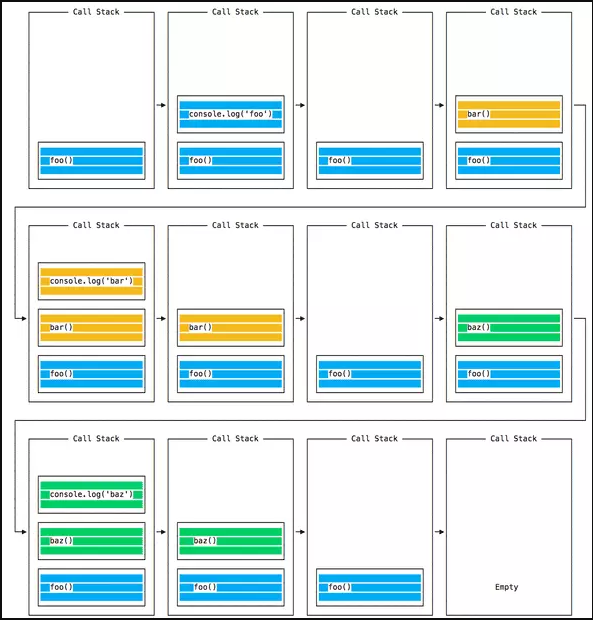
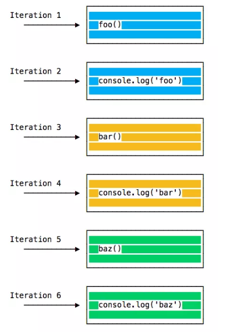
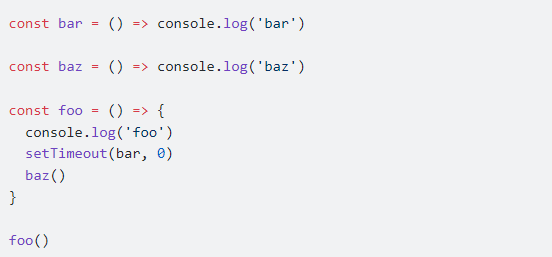
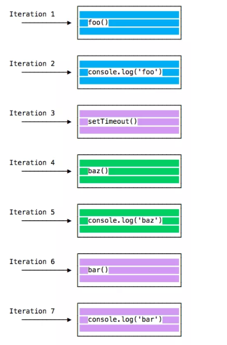

# Bài 1 - Tổng quan khoá học, giới thiệu nodejs

## I. Mục tiêu

*  Giúp học viên nắm tổng quan chương trình học.
*  Phương pháp học [#link](https://www.youtube.com/watch?v=DpvYHLUiZpc)
* Tổng quan nodejs, kiến trúc nodejs
------
## II. Nội dung bài học

### 1. Tổng quan khoá học
#### 1.1 Backend nodejs – Express and Mongo - mongoose:
- 9-11 buổi
- Hiểu nodejs cấu trúc, khả năng
- Module quan trọng của nodejs
- Dùng Express để làm dự án
- Kết học nodejs và mongo
- Project nhóm và thuyết trình
- [Roadmap](https://github.com/aliyr/Nodejs-Developer-Roadmap/blob/master/ReadMe.md)

#### 1.2 Front-end React-JS
- 9-10 buổi
- Viết web bằng react
- Sử dụng redux thunk, redux-saga
- Tích hợp api
- Sử dụng thư viện UI (antd/ material design/tailwindCSS)
- [Roadmap](https://github.com/adam-golab/react-developer-roadmap)

### 2. NodeJS

#### 2.1 Tổng quan kiến trúc nodejs

- Tổng quan server-client (backend - fontend):
    *  Frontend là phần tương tác với người dùng là phần người dùng nhìn thấy và tương tác: giao diện web, app.

    * Backend cũng là một phần mềm, có chức năng hồi đáp những yêu cầu từ Front-end .Thường xử lý lưu trữ dữ liệu và logic nghiệp vụ.
    * Các ngôn ngữ phổ biến ở BE: java (1995), C#, PHP (1995), Python, .NET (C#, VB), Go, RUST

    * [# theo wiki](https://en.wikipedia.org/wiki/Front_end_and_back_end)

- Nodejs là gì? vì sao ra đời, khả năng nodejs
    * Trước khi nodejs ra đời js chạy chủ yếu trên browser (F12 trên browser để chạy thử) => ngôn ngữ cho client-side xử lý event user. Không có khả năng thao tác phần cứng máy tính (Thao tác được với file, hệ thống hay cơ sở dữ liệu)
        ```
            1 + 1
        ```

    * [# nodejs?](https://nodejs.org/en/) Runtime environment built on Chrome's V8 JavaScript engine.

    * [# JavaScript engine ?](https://www.youtube.com/watch?v=p-iiEDtpy6I
      ) A JavaScript engine is a computer program that executes JavaScript (JS) code ([#wiki](https://en.wikipedia.org/wiki/JavaScript_engine#:~:text=A%20JavaScript%20engine%20is%20a,every%20major%20browser%20has%20one.))
        * Tại sao là v8?
        * SpiderMonkey  <=> Firefox
        * Nitro <=> Safari
        * Chakra <=> Internet Explorer


    * => Chốt:  ````JavaScript to run without browser → NodeJS ````
    * [# kiến trúc](https://blog.usejournal.com/nodejs-architecture-concurrency-model-f71da5f53d1d
)
* [# Eventloop](https://www.youtube.com/watch?v=8aGhZQkoFbQ)
    - Trả lời câu hỏi : làm cách nào để Node.js có thể xử lý bất đồng bộ (asynchronous) và non-blocking I/O ?
    - Minh họa event loop
      
    - Một vài đặc điểm của NodeJS
      - Node.js là xử lý đơn luồng, nên nó sẽ chỉ làm một việc một lúc.
      - Blocking the event loop: Khi đoạn code Javascript mà mất quá nhiều thời gian để xử lý sẽ chặn việc thực thi thêm bất kỳ đoạn code Javascript nào trong trang hoặc có thể sẽ chặn luôn cả luồng UI và người dùng không thể click chuột hay cuộn trang
      - Hầu như tất cả các I/O trong JS đều là non-blocking: Network request, filesystem, v.v.
    - Callstack:
      - Call stack là một LIFO (Last In, First Out) queue.
      - Event Loop sẽ liên tục kiểm tra call stack để xem có function cần thực thi hay không.
      - Ví dụ:
        ```angular2html
            const bar = () => console.log('bar')
            const baz = () => console.log('baz')
            const foo = () => {
               console.log('foo')
               bar()
               baz()
            }
            foo()
        ```
        
      - 
      - Ví dụ 2 :
        
        ```
        // Output
        foo
        baz
        bar
        ```
        
        
- Chạy thử nodejs
    - Command line interface (CLI) trên máy tính (RELP Terminal)
        * Read − Reads user's input, parses the input into JavaScript data-structure, and stores in memory.

        * Eval − Takes and evaluates the data structure.

        * Print − Prints the result.

        * Loop − Loops the above command until the user presses ctrl-c twice.
    ```
        # cmd / terminal
        node
        > 1 + 1
        2
    ```
    - Dùng nodejs đọc và thực thi file js
    ```
    # index.js
    const a = 1;
    const b = 2;
    console.log(a+b);
    # cmd
    node index.js
    ```
- NPM, module, export and require
    - Module là gì ? có bao nhiêu loại
        * Core Modules (module của nodejs)
        * Local Modules (module tự tạo )
        * Third Party Modules (module người khác viết và đẩy lên npmjs.com )
    - npm là gì?
        * node package manger
        * quản lý package của nodejs
        * quản lý bằng cách nào ?
    - cấu trúc thư mục
        * package.json/package-log.json
        * node_modules
        * devDependencies
        * dependencies
    - khởi tạo chương nodejs với npm
        ``` 
        npm init 

        npm i module_name
        npm install module_name
        npm uninstall module_name
        ```

-------
## III Tổng kết
- nodejs là Runtime environment built on Chrome's V8 JavaScript engine.
    - => là môi trường để viết js trên máy tính (máy server/ server side)
    - => học sử dụng các module mà nodejs cung cấp để viết backend (tác vụ server)
- Event loop của nodejs hoạt động ntn
    - cơ chế hoạt động của đơn luồng/ bất đồng bộ / non-bloking io

- npm là gì và cách sử dụng, cấu trúc package.json
- thử nghiệm các loại module và khởi tạo dự án với npm


## IV Bài tập về nhà
- Trả lời và thảo luận vòng tròn các chủ đề: (20-30 phút đầu giờ)
    - 1. Xem youtube, đọc tài liệu về event loop để thảo luận
    - 2. Có bao nhiêu kiểu dữ liệu căn bản của js, bao nhiêu cấu trúc dữ liệu căn bản của js
    - 3. ES là gì ES6 là gì. Có gì đặc biệt trong ES6