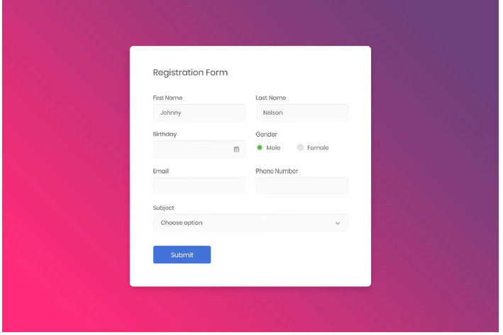

### Bài 1 (**):
Cho 1 mảng json danh sách user như sau:
const users = [
{ 
  id: 1, 
  name: 'Nguyen Tuan Anh',
  phoneNumber: '098721245',
  email: 'victory1080@gmail.com',
  gender: 'boy'
  age: 31
}, 
{ // ban 1 }, { // ban 2 } ]

// Hoan thanh API - Tao 1 member moi
- Sử dụng postman, call đến API (POST) http://localhost:5000/api/user -> Tạo ra 1 thành viên mới của lớp
- Validate
+ name: Phải là string, ít nhất 15 ký tự, không được bao gồm số.
+ phoneNumber: phải là số, 10-12 ký tự.
+ email: đúng định dạng email
+ gender: chỉ được truyền vào 3 loại : nam, nữ, không xác định
+ age: phải nhỏ 200

### Bài 2 (***):

- Tạo 1 trang đăng ký thông tin người dùng có giao diện như sau:

- Khi người dùng nhấn submit thì validate các trường thông tin.
Nếu trường thông tin nào không đủ điều kiện => Show báo lỗi màu đỏ bên dưới trường đó.
+ FirtName + LastName: Phải là string.
+ Birthday: Chỉ điền năm sinh và phải là số. (1999)
+ Gender: Required
+ Email: Phải là định dạng của email
+ Phone Number: Phải là số và 10-12 ký tự
+ Subject: bỏ qua.

- Khi các thông tin validate OK -> Show thông tin chi tiết vừa nhập sang 1 trang mới giống demo

