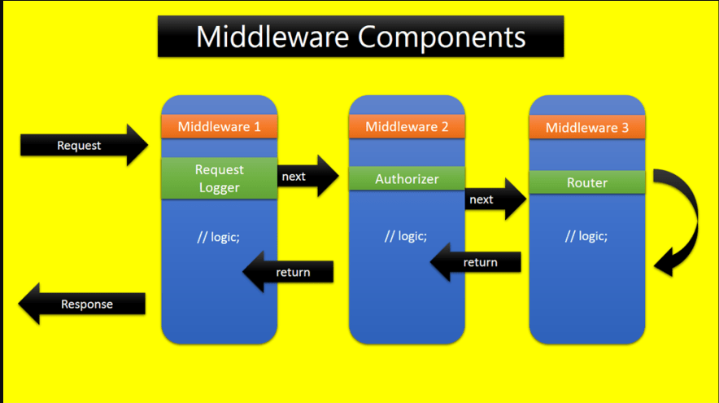

#### Middleware trong ExpressJs

- ExpressJs khi hoạt động sẽ là một loạt các hàm Middleware được thực hiện liên tiếp nhau. 
- Các request từ phía người dùng khi gửi lên ExpressJS sẽ thực hiện lần lượt qua các hàm Middleware cho đến khi trả về response cho người dùng.
- Các hàm này sẽ được quyền truy cập đến các đối tượng đại diện cho Request – req, Response – res, hàm Middleware tiếp theo – next, và đối tượng lỗi – err nếu cần thiết.
- Một hàm Middleware sau khi hoạt động xong, nếu chưa phải là cuối cùng trong chuỗi các hàm cần thực hiện, sẽ cần gọi lệnh next() để chuyển sang hàm tiếp theo



#### Trong Express, có 5 kiểu middleware có thể sử dụng

- Application-level middleware (middleware cấp ứng dụng)
- Router-level middleware (middlware cấp điều hướng – router)
- Error-handling middleware (middleware xử lý lỗi)
- Built-in middleware (middleware sẵn có)
- Third-party middleware (middleware của bên thứ ba)

##### 1. Application-level middleware

- Khi khởi tạo một Web Application với ExpressJS, chúng ta sẽ có một đối tượng đại diện cho Web App đó
- Đối tượng này có thể khai báo các middleware thông qua các hàm : app.use() or app.get(), app.post()...
- Ví dụ 1: middleware ko khai báo đường dẫn cụ thể, do đó hàm này sẽ được thực hiện mỗi lần request
```integrationperformancetest
var app = express();
app.use(function (req, res, next) {
  console.log('Time:', Date.now())
  next()
})
```

- Ví dụ 2: hàm được thực hiện mỗi khi truy cập đến đường dẫn /user/:id bằng phương thức GET:
```integrationperformancetest
app.get('/user/:id', function (req, res, next) {
  res.send('USER')
})
```

##### 2. Router-level middleware

- Giống hệt app middleware, nhưng dùng cho router
- ExpressJS cung cấp một đối tượng router chuyên dùng để khai báo route bằng cách gọi hàm sau

```integrationperformancetest
var router = express.Router()
```

```integrationperformancetest
// Middleware này sử dụng cho mọi request tới router
router.use(function (req, res, next) {
  console.log('Time:', Date.now())
  next()
})

// middleware apply cho cả GET, POST, PUT, DELETE, PATCH...
// khi truy cập vào /user/:id
router.use('/user/:id', function (req, res, next) {
  console.log('Request URL:', req.originalUrl)
  next()
}, function (req, res, next) {
  console.log('Request Type:', req.method)
  next()
})

// middleware chỉ apply cho GET khi truy xuất vào /user/:id
router.get('/user/:id', function (req, res, next) {
  // if the user ID is 0, skip to the next router
  if (req.params.id === '0') next('route')
  // otherwise pass control to the next middleware function in this stack
  else next()
}, function (req, res, next) {
  // render a regular page
  res.render('regular')
})
```

##### 3. Error-handling middleware

```integrationperformancetest
app.use(function (err, req, res, next) {
  console.error(err.stack)
  res.status(500).send('Something broke!')
})
```

##### 4. Built-in middleware

- Kể từ version express 4.x
- Ví dụ middleware tạo ra 3 thư mục static

```integrationperformancetest
app.use(express.static('public'))
app.use(express.static('uploads'))
app.use(express.static('files'))

// http://localhost:3000/images/abc.jpg
```

##### 5. Third-party middleware

- Các middleware của bên thứ 3
- Ví dụ:
- Cài đặt và sử dụng một middlware có tên là cookie-parser dùng để đọc cookies của request:
```integrationperformancetest
npm install cookie-parser
```

```integrationperformancetest
var express = require('express')
var app = express()
var cookieParser = require('cookie-parser')

// load the cookie-parsing middleware
app.use(cookieParser())
```