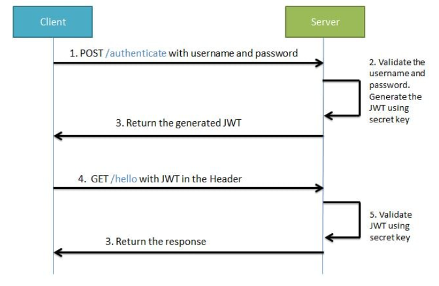

## Authentication và Authorization

### 1. Authentication (bạn là ai ?)
- Authentication là quá trình hệ thống kiểm tra, xác định danh tính của người dùng hoặc một hệ thống khác đang truy cập vào hệ thống hiện tại.
- Authentication xác thực chủ yếu dựa trên hai thông tin: tên người dùng và mật khẩu.

### 2. Authorization (bạn được làm gì ?)
- Authorization thường được thực hiện sau khi quá trình authentication kết thúc.
- Xác định bước tiếp theo xác định bạn được phép làm gì trong hệ thống.

## Token Based Authentication

- Sơ đồ hoạt động của JWT



- Giải thích:
  + Khi chúng ta đăng nhập một tài khoản và gửi các thông tin như email/password lên server thì nó sẽ ký một token
  + Và gửi token đó về phía client để lưu trữ.
  + Cứ như vậy mỗi lần client truy cập trang thì sẽ gửi request lên thì phải kèm theo token
  + Server sẽ check mã này và gửi lại response thành công hay thất bại tương ứng ngược về client.

- Các thành phần của JWT
    + Header
    + Payload
    + Signature
    
- Cấu trúc kết hợp: `header.payload.signature`
- Ứng dụng Client thường đính kèm mã JWT vào header với tiền tố Bearer

```angular2html
Authorization: Bearer [header].[payload].[signature]
```

hoặc chỉ cần thêm một trường x-access-token trong header

```angular2html
x-access-token: [header].[payload].[signature]
```

## JWT với nodejs và mongodb

- Bước 1: Thiết lập web server
- Bước 2: Thiết lập database
- Bước 3: Định nghĩa Schema model
- Bước 4: Xử lý yêu cầu đăng ký
  + 1. Tạo user
  + 2. Validate user
  + 3. Check email có tồn tại hay không
  + 4. Mã hóa password
- Bước 5: Xử lý yêu cầu đăng nhập
  + 1. Validate user
  + 2. Check email và password
  
- Bước 6: Xử lý xác thực bằng JWT
  + 1. Tạo token
  + 2. Verify token

## Hướng dẫn code theo từng step

- Tóm tắt các công việc cần làm:
1. Đăng ký (validate, mã hóa password)
2. Đăng nhập (lấy về token)
3. Sử dụng token để truy cập các private routes khác.

#### Cài đặt library

```angular2html
npm init 
```

để generate file package.json

- Cài đặt các thư viện cần thiết

```angular2html
npm install express body-parse nodemon mongoose dotenv @hapi/joi bcryptjs jsonwebtoken --save
```

- Giải thích các library
  + express: Module dùng để cài đặt framework express của nodejs giúp code một cách tối giản cũng như nhanh chóng hơn.
  + body-parse: Package body-parser dùng để truy xuất dữ liệu trong form gửi lên server theo phương thức POST.
  + nodemon: Tự động reload lại server khi thay đổi code. Để khởi chạy server thêm "devStart": "nodemon app.js" vào file package.json nha. Mở terminal lên sau đó gõ npm run devStart để khởi chạy server.
  + mongoose: Mongoose là một Object Document Mapper (ODM). Điều này có nghĩa là Mongoose cho phép định nghĩa các object (đối tượng) với một schema được định nghĩa rõ ràng.
  + dotenv: Dotenv là một biến môi trường dùng để bảo mật các thông tin quan trọng như username, password, url database,...Nếu chúng ta không lưu những thông tin mật vào file .env thì khi push source code lên github thì ai cũng có thể vào xem được và ai cũng biết username, password thì sẽ bị người khác chiếm đoạt và đánh cắp tài liệu rất là nguy hiểm.
  + @hapi/joi: Module Joi này dùng để xác nhận dữ liệu, ví dụ khi nhập password bắt buộc phải nhập trên 6 từ hay là email phải nhập đúng các kiểu kí tự để tạo email,..thì cần phải xác nhận cho nó bằng module joi.
  + bcryptjs: Module dùng để mã hóa password.
  + jsonwebtoken: Module này dùng để xác thực và tạo các private routes.

#### Thiết lập server

- Trong thư mục gốc tạo file app.js

```angular2html
const express = require("express");
const app = express();
const bodyParser = require('body-parser');
const port = 3333;

// Import routes
const indexUser = require("./routes/index")

// Gửi yêu cầu phân tích kiểu nội dung application/x-www-form-urlencoded
app.use(bodyParser.urlencoded({ extended: true }))

// Gửi yêu cầu phân tích kiểu nội dung application/json
app.use(bodyParser.json())

// Route middlewares
app.use('/api/user',indexUser)

// Lắng nghe các requests
app.listen(port, function(){
    console.log("Server listening port", +port)
})
```

- Trong thư mục gốc thư mục routes, trong folder routes tạo index.js

```angular2html
const express = require("express");
const router = express.Router();

router.get('/',function(req, res, next){
    res.send('Hello World')
})

module.exports = router;
```

- Run server

```angular2html
npm start
```

- Access vào link

```angular2html
localhost:3333/api/user -> Hello World
```